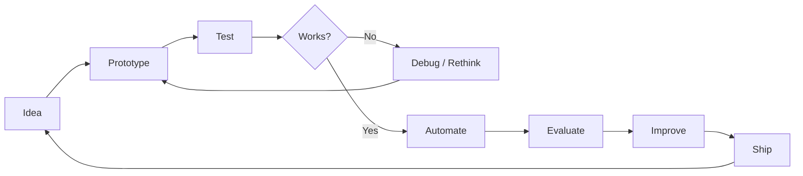

<!--
  ╔══════════════════════════════════════════════════════════════╗
  ║                 AARON SLUTSKY / coolguytuff                ║
  ║            AI systems • agents • automation                ║
  ╚══════════════════════════════════════════════════════════════╝
-->

<div align="center">


<a href="https://github.com/coolguytuff">
  
</a>

<br/>

[](https://github.com/coolguytuff)
[](https://github.com/coolguytuff?tab=followers)


</div>

---

## `> whoami`

```text
┌─[ coolguytuff@github ]
│
├── name        : Aaron Slutsky
├── building    : autonomous AI systems • agent architectures • automation
├── exploring   : orchestration • evaluation • long-running agents • software reconstruction
├── objective   : turn "AI can help" into "the system actually finished it"
├── method      : build → break → measure → improve → ship
│
└── status      : [████████████████████░] always building
```

I build experimental software around one idea: **AI should be able to carry real work forward, not just produce a clever response.**

That means systems that can maintain context, use tools, coordinate agents, evaluate outcomes, recover from failure, and keep executing toward an objective.

<div align="center">

### `SYSTEM INTERESTS`


</div>

---

## ⚡ Current build zone

<table>
<tr>
<td width="50%" valign="top">

### 🧠 Dave — Personal Agent OS

A private experimental **personal Agent OS** exploring persistent AI identity, governed autonomy, multi-agent execution, evaluation, local-first operation, and dependable long-running work.

**Focus**

`agent runtime` `governance` `memory` `evaluation` `orchestration` `local-first`

</td>
<td width="50%" valign="top">

### 🛰️ OmniRoute

Infrastructure and routing experimentation for smarter AI/software workflows.

<br/>

[](https://github.com/coolguytuff/OmniRoute)

<br/>

`routing` `AI infrastructure` `systems`

</td>
</tr>
<tr>
<td width="50%" valign="top">

### 🎬 Automated Media Systems

Experiments in turning multi-stage creative workflows into repeatable software pipelines.

<br/>

[**A-auto-RedditVideoMakerBot →**](https://github.com/coolguytuff/A-auto-RedditVideoMakerBot)  
[**autovid-system →**](https://github.com/coolguytuff/autovid-system)

</td>
<td width="50%" valign="top">

### 🧪 Software Experiments

Agent platforms, automation systems, reconstruction workflows, developer tooling, prompt systems, and whatever is interesting enough to prototype.

<br/>

> **Prototype aggressively. Keep what survives contact with reality.**

</td>
</tr>
</table>

---

## 🧰 Tech playground

<div align="center">


<br/><br/>

`LLMs` • `Agent Systems` • `GitHub Actions` • `APIs` • `Local Models` • `Prompt Engineering` • `Automation` • `Evaluation`

</div>

---

## 📡 GitHub telemetry

<div align="center">


<br/>


</div>

---

## 🐍 Contribution engine

<div align="center">

<picture>
  <source media="(prefers-color-scheme: dark)" srcset="https://raw.githubusercontent.com/coolguytuff/coolguytuff/output/github-contribution-grid-snake-dark.svg" />
  <source media="(prefers-color-scheme: light)" srcset="https://raw.githubusercontent.com/coolguytuff/coolguytuff/output/github-contribution-grid-snake.svg" />
  
</picture>

<sub>Generated automatically from my contribution graph.</sub>

</div>

---

## 🧬 How I think about building



> The interesting part of AI isn't getting one impressive answer. It's building systems that remain useful **after the first answer**.

---

<div align="center">

### `CURRENT MISSION`

**Build increasingly capable software that can reason, act, evaluate, adapt, and finish meaningful work.**

<br/>


</div>
