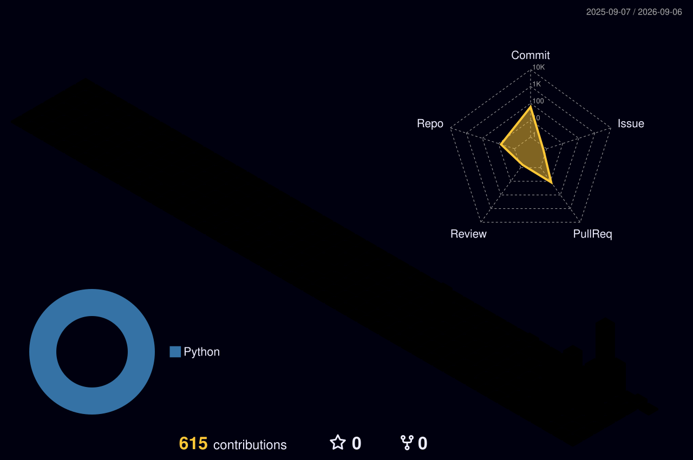
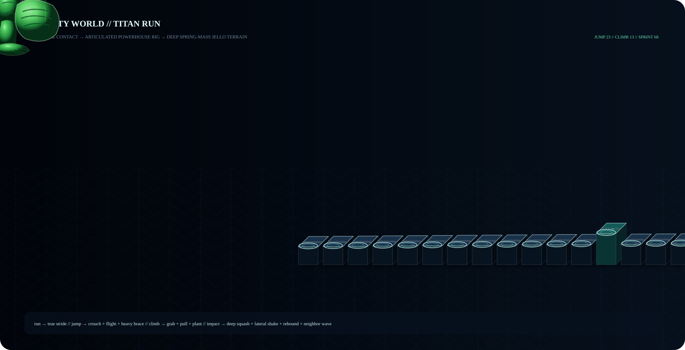
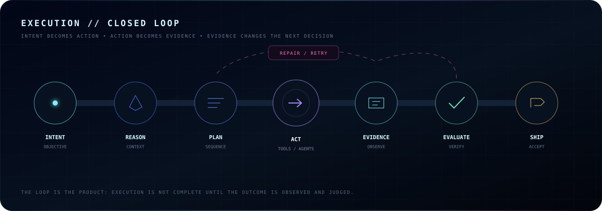
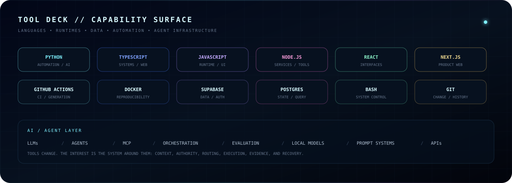
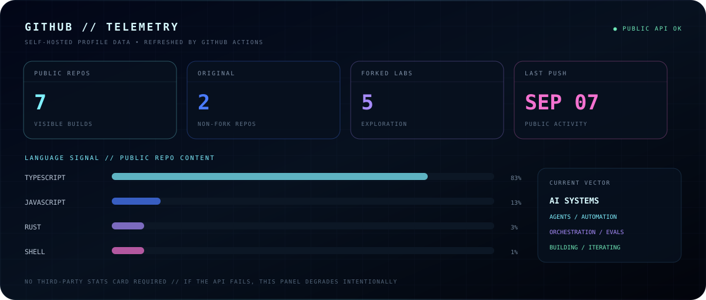

<!--
  AARON SLUTSKY // @coolguytuff
  DAVE COMMAND PROFILE
  Primary visuals are self-hosted in this repository.
-->

<p align="center">
  
</p>

<div align="center">

### `CONTRIBUTION MATRIX // 3D HISTORY`

**The build history comes first.** Every block below is generated from my GitHub contribution graph.

<picture>
  <source media="(prefers-color-scheme: dark)" srcset="./profile-3d-contrib/profile-night-rainbow.svg" />
  <source media="(prefers-color-scheme: light)" srcset="./profile-3d-contrib/profile-gitblock.svg" />
  
</picture>

<sub>`3D CONTRIBUTION TOPOLOGY // generated in-repo // theme-aware`</sub>

</div>

<br/>

<p align="center">
  
</p>

<p align="center"><sub><b>DAVE // PRIVATE R&D</b> · slow pseudo-3D turntable motion · GitHub-native SVG · no JavaScript · no separate site</sub></p>

## `01 // DAVE`

> **Dave** is my private experimental **Personal Agent OS** — an attempt to make one coherent system out of identity, context, agents, teams, tools, execution, evaluation, governance, and recovery.

<table>
<tr>
<td width="33%" valign="top"><b>IDENTITY</b><br/><sub>Persistent context and a stable system identity across work.</sub></td>
<td width="33%" valign="top"><b>EXECUTION</b><br/><sub>Agents and teams that can carry long-running objectives through tools and workflows.</sub></td>
<td width="33%" valign="top"><b>GOVERNANCE</b><br/><sub>Authority, routing, safety, evidence, and recovery are system properties — not afterthoughts.</sub></td>
</tr>
<tr>
<td width="33%" valign="top"><b>EVALUATION</b><br/><sub>Outcomes are observed and judged instead of assumed successful.</sub></td>
<td width="33%" valign="top"><b>LOCAL-FIRST</b><br/><sub>Use local capability where it is appropriate, with explicit routing and graceful fallback.</sub></td>
<td width="33%" valign="top"><b>EVOLUTION</b><br/><sub>Capabilities can improve through governed experimentation rather than uncontrolled self-modification.</sub></td>
</tr>
</table>

<sub>The repository is private while I build it. This profile describes the direction at a high level, not private implementation details.</sub>

---

## `02 // ACTIVITY WORLD`

<div align="center">

**The contribution graph becomes a world instead of a chart.** TITAN is an original green synthetic powerhouse running across contribution-derived 3D block terrain. Rough changes trigger leaps, modest rises trigger a ledge grab + pull-up, flat runs of 3+ blocks trigger a sprint, and every impact squishes the terrain before it settles exactly back to its real data height.

<p>
  
</p>

<sub>`TITAN // follow-cam traversal // forward + reverse // generated from real contribution signal`</sub>

</div>

---

## `03 // SIGNAL`

I’m interested in the point where AI stops being a chat box and starts becoming a **system**: persistent context, tools, planning, execution, evidence, evaluation, recovery, coordination, and actual completion.

<table>
<tr>
<td width="50%" valign="top">

### What I build

- autonomous and multi-step agent systems
- automation pipelines that remove repetitive work
- AI-native product experiments
- tooling for orchestration, evaluation, and execution
- reconstruction/research workflows for understanding complex software

</td>
<td width="50%" valign="top">

### What I optimize for

- **completion over cleverness**
- evidence over vibes
- strong authority boundaries
- recoverable failure modes
- local-first operation where it makes sense
- systems that improve without becoming uncontrollable

</td>
</tr>
</table>

---

## `04 // EXECUTION LOOP`

<p align="center">
  
</p>

---

## `05 // BUILD DOMAINS`

<table>
<tr>
<td width="50%" valign="top">

### `AGENT SYSTEMS`
Systems that maintain context, choose tools, coordinate work, recover from failure, and keep objectives moving across many steps.

`memory` · `planning` · `tool use` · `teams` · `evaluation`

</td>
<td width="50%" valign="top">

### `AUTOMATION ENGINES`
Turn repetitive or multi-stage workflows into dependable software that requires less babysitting.

`pipelines` · `workflows` · `media` · `APIs` · `scheduling`

</td>
</tr>
<tr>
<td width="50%" valign="top">

### `EXPERIMENTAL AI SOFTWARE`
Prototype ambitious ideas early enough to find out what actually works — especially when models, tools, data, and runtime behavior interact.

`R&D` · `AI-native products` · `architecture` · `prototyping`

</td>
<td width="50%" valign="top">

### `SOFTWARE RECONSTRUCTION`
Research complex products, map behavior and architecture, then use that understanding to rebuild or improve the experience.

`research` · `systems analysis` · `product behavior` · `UX`

</td>
</tr>
</table>

---

## `06 // PUBLIC LAB`

Public GitHub is only one slice of what I’m working on. I keep forked research repos visibly labeled instead of presenting upstream work as mine.

**Original public build**

- **[autovid-system](https://github.com/coolguytuff/autovid-system)** — AI-powered automated short-form video generation engine for TikTok, Shorts, and Reels.

**Forked exploration / reference labs**

- **[OmniRoute](https://github.com/coolguytuff/OmniRoute)** `fork` — exploring AI gateway, routing, fallback, and multi-provider infrastructure.
- **[ruflo](https://github.com/coolguytuff/ruflo)** `fork` — exploring multi-agent harnesses, swarm coordination, memory, and agent tooling.
- **[ECC](https://github.com/coolguytuff/ECC)** `fork` — exploring agent-harness performance, skills, memory, security, and research-first workflows.
- **[A-auto-RedditVideoMakerBot](https://github.com/coolguytuff/A-auto-RedditVideoMakerBot)** `fork` — automation reference for multi-platform short-form media workflows.

---

## `07 // TOOL DECK`

<p align="center">
  
</p>

---

## `08 // TELEMETRY`

<p align="center">
  
</p>

<sub>This panel is generated into the repo itself. If the GitHub API is temporarily unavailable, it renders an intentional degraded state instead of broken linked-image text.</sub>

---

## `09 // OPERATING PRINCIPLES`

```text
01  build the real thing, not a demo of the thing
02  observe outcomes instead of assuming success
03  automate repeated work, preserve human authority
04  make failures visible, bounded, and recoverable
05  use the right model and tool for the job
06  preserve context; improve the system; keep shipping
```

---

<div align="center">

### `TRANSMISSION // END`

**I build things I wish already existed.**

<sub>systems over prompts · outcomes over demos · curiosity over convention</sub>

</div>
