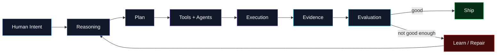

<!-- =========================================================
     AARON SLUTSKY // coolguytuff
     PERSONAL AI LAB // SYSTEMS • AGENTS • AUTOMATION
     ========================================================= -->

<div align="center">


<a href="https://github.com/coolguytuff">

</a>

<br/>


</div>

---

## `00 // ENTER THE LAB`

<div align="center">
  
</div>

```text
┌──────────────────────────────────────────────────────────────────────────────┐
│  OPERATOR : AARON SLUTSKY                                                   │
│  HANDLE   : coolguytuff                                                     │
│  DOMAIN   : autonomous agents • orchestration • automation • AI systems     │
│  MISSION  : make software capable of carrying real objectives forward       │
│  LOOP     : build → break → measure → improve → ship                        │
│  STATE    : ████████████████████████████████████  ONLINE                    │
└──────────────────────────────────────────────────────────────────────────────┘
```

> **I’m interested in the point where AI stops being a chat box and starts becoming a system:** persistent context, tools, planning, execution, evaluation, recovery, coordination, and actual completion.

---

## `01 // THE 3D GRID`

<div align="center">

### My GitHub activity — rendered as a 3D city

<picture>
  <source media="(prefers-color-scheme: dark)" srcset="./profile-3d-contrib/profile-night-rainbow.svg" />
  <source media="(prefers-color-scheme: light)" srcset="./profile-3d-contrib/profile-gitblock.svg" />
  
</picture>

`every block = something built, tested, broken, fixed, or learned`

</div>

---

## `02 // WHAT I BUILD`

<table>
<tr>
<td width="50%" valign="top">

### 🧠 Agent Systems

Software that can keep context, choose tools, coordinate work, recover from failure, and move an objective forward across many steps.

`memory` `planning` `tool use` `orchestration` `evaluation`

</td>
<td width="50%" valign="top">

### ⚙️ Automation Engines

Turning repetitive human workflows into systems that can execute reliably with minimal babysitting.

`pipelines` `workflows` `media` `routing` `agents`

</td>
</tr>
<tr>
<td width="50%" valign="top">

### 🧬 Experimental AI Software

I like taking ambitious ideas seriously enough to prototype them — especially systems that combine multiple models, tools, and execution layers.

`R&D` `prototypes` `AI-native software` `architecture`

</td>
<td width="50%" valign="top">

### 🔬 Software Reconstruction

Studying how complex products behave, mapping their systems, and learning how to rebuild or improve the underlying experience.

`research` `reverse engineering` `product systems` `UX`

</td>
</tr>
</table>

---

## `03 // ACTIVE EXPERIMENTS`

<div align="center">

<a href="https://github.com/coolguytuff/OmniRoute">
  
</a>
<a href="https://github.com/coolguytuff/A-auto-RedditVideoMakerBot">
  
</a>

<a href="https://github.com/coolguytuff/autovid-system">
  
</a>
<a href="https://github.com/coolguytuff/ECC">
  
</a>

</div>

### `CLASSIFIED / PRIVATE R&D`

```text
PROJECT DAVE  ███████████████████████░  PERSONAL AGENT OS

persistent identity  ─────┐
agent/team runtime   ─────┼──► governed autonomous execution
objective evaluation ─────┤
capability evolution ─────┤
local-first systems  ─────┘
```

Some of my biggest experiments are private while I build them. The public repos are only part of the lab.

---

## `04 // SYSTEM ARCHITECTURE`



---

## `05 // TOOL DECK`

<div align="center">


<br/><br/>

`LLMs` • `Agents` • `GitHub Actions` • `Automation` • `APIs` • `Local Models` • `Prompt Systems` • `Evaluation` • `Orchestration`

</div>

---

## `06 // LIVE TELEMETRY`

<div align="center">


<br/>


</div>

---

## `07 // CONTRIBUTION CREATURE`

<div align="center">

<picture>
  <source media="(prefers-color-scheme: dark)" srcset="https://raw.githubusercontent.com/coolguytuff/coolguytuff/output/github-contribution-grid-snake-dark.svg" />
  <source media="(prefers-color-scheme: light)" srcset="https://raw.githubusercontent.com/coolguytuff/coolguytuff/output/github-contribution-grid-snake.svg" />
  
</picture>

</div>

---

## `08 // OPERATING PRINCIPLES`

```text
01  build the real thing, not the demo of the thing
02  measure outputs instead of trusting vibes
03  automate repeated work
04  keep humans in control of what matters
05  make failures observable and recoverable
06  use the right model/tool for the job
07  preserve context
08  keep improving the system itself
09  curiosity > convention
10  ship
```

---

<div align="center">

### `TRANSMISSION // END`


<br/>

<a href="https://github.com/coolguytuff">

</a>

<br/><br/>


</div>
